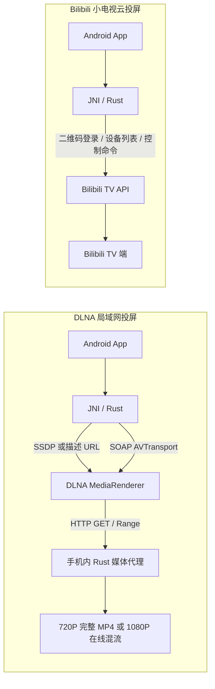
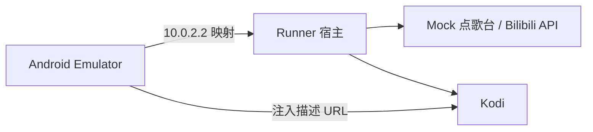
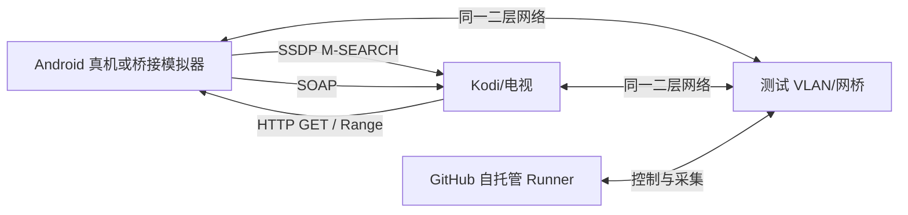

# 投屏自动化与虚拟化测试环境设计

> 状态：调研与方案设计；本轮不实现测试环境。  
> 范围：`ktv-casting` Rust 引擎、`ktv-casting-android-app`，以及 DLNA 与 Bilibili 小电视两种投屏模式。

## 1. 结论

可以显著减少“构建 Rust → 发布 Rust → 构建 App → 下载到手机 → 人工投屏”的循环，但不应试图用一个全虚拟环境替代所有真实设备。

推荐建立三层测试体系：

1. **每个 PR 的确定性协议测试**：在 GitHub 托管 Runner 上运行 Rust、Android 单元/UI 测试、Mock DLNA 渲染器与 Mock Bilibili TV API。速度快、无账号、无真实 B站依赖。
2. **Kodi + Android 模拟器集成测试**：验证 APK、JNI、Rust 媒体代理、真实播放器解码、1080P 双轨混流、音频、时长和拖动。普通路径可使用直连地址；完整局域网路径放到自托管 Runner。
3. **真机夜间/手动实验室**：一台 Android 手机、Kodi/电视和专用 B站账号，验证 SSDP、多播、手机本地网络、真实 B站小电视登录与云投屏。它提供兼容性信心，但不阻塞普通 PR。

最重要的 CI/CD 改造方向是：**候选 Rust `.so` 必须先作为同一次工作流的 Artifact 交给 App 联测，测试通过后才打 tag；tag 仍然是创建 GitHub Release 的唯一入口。** 这样不再为了验证一个候选版本而先发布它。

## 2. 当前链路与问题

### 2.1 两种投屏模式不是同一种测试问题



DLNA 的难点是局域网、多播、设备反向访问手机 HTTP 服务和真实媒体解码。Bilibili 模式的难点是外部 API、扫码登录、会话过期、在线设备状态，以及 TV 端没有完整状态回读。

因此：

- DLNA 可以构造标准协议渲染器，并用 Kodi 验证媒体结果。
- Bilibili 可以完整模拟客户端看到的 HTTP API，但无法在公共 CI 中稳定复刻 B站服务端和官方 TV App 的内部行为。
- “Mock API 测试通过”只能证明本项目发出了正确请求；“真实小电视测试通过”才能证明第三方服务当前仍兼容。

### 2.2 现有 CI 是发布后集成，不是发布前联测

Rust 仓库当前有两条构建路径：

- `.github/workflows/build.yml`：`master`/PR 编译检查，目标集合较旧。
- `.github/workflows/build_with_android.yml`：仅 `v*` tag 执行完整 Android 四 ABI 和桌面产物构建，并发布 Release。

App 仓库的 `.github/workflows/build-and-release.yml` 会从 `gradle.properties` 读取 `rust_libs_version`，再从 Rust GitHub Release 下载四个 `.so`。当前测试目录只有 Android 模板示例，工作流也没有执行 `test` 或 instrumented tests。

这导致候选代码必须先变成 Rust Release，App 才能构建并在手机验证。若发现问题，只能继续发新版本，反馈周期长且会积累无意义的开发 Release。

### 2.3 本地网络无法由普通 Android 模拟器透明复刻

Android Emulator 默认位于 `10.0.2/24` 虚拟路由后，`10.0.2.2` 是访问宿主机回环地址的特殊别名。官方文档同时说明模拟器不支持 IGMP，而 SSDP 使用 `239.255.255.250:1900` 多播。这意味着普通托管 Runner 上的模拟器不适合直接验证真实 SSDP 发现。

更关键的是，DLNA 播放不是单向控制：Kodi/电视还必须反向访问 Android 模拟器中的 Rust HTTP 服务。NAT、端口映射和本地 IP 选择会让它与真实 Wi-Fi 行为不同。

所以应拆分成两条网络路径：

- 快速 CI：使用可注入的设备描述 URL 和显式主机地址，绕开 SSDP，重点验证业务和协议。
- 完整 E2E：使用同一二层网段或桥接网络，验证 SSDP 和设备反向拉流。

## 3. 推荐架构

### 3.1 三层金字塔

| 层级 | 运行位置 | 终端/依赖 | 主要验证 | 建议触发 |
| --- | --- | --- | --- | --- |
| L1 确定性协议测试 | GitHub 托管 Linux Runner | Mock DLNA、Mock Bilibili、固定媒体 | Rust 状态机、SOAP/API 请求、Range、混流结构、失败回退 | 每个 PR、每次 push |
| L2 虚拟集成测试 | 托管 Runner + 自托管 Linux Runner | Android Emulator、Kodi/Xvfb | APK/JNI/UI、真实解码、声音、时长、拖动 | PR 关键变更、合并到 master |
| L3 真机兼容测试 | 专用自托管实验室 | Android 真机、Kodi/电视、B站小电视 | SSDP、真实 Wi-Fi、厂商兼容、真实登录和云投屏 | 夜间、发布候选、手动 |

三层的职责不能互相替代：L1 定位错误最快；L2 能发现“协议正确但播放器不接受”；L3 能发现模拟网络和真实第三方服务无法覆盖的问题。

### 3.2 测试编排组件

建议未来增加一个独立的 `casting-test-harness`，可先作为 Rust 仓库中的测试工具，成熟后再决定是否拆仓。它负责：

- 启动固定的点歌台/歌单 HTTP 与 WebSocket fixture。
- 启动 Mock DLNA MediaRenderer。
- 启动 Mock Bilibili TV API。
- 启动本地媒体 fixture 服务。
- 驱动 Rust CLI/JNI 或 Android UI。
- 读取 Mock 状态、Kodi JSON-RPC 和日志并生成 JUnit 报告。
- 在失败时打包 Rust 日志、App logcat、Kodi 日志、协议 transcript、截图和必要的网络抓包。

测试工具不应通过解析自然语言日志来判断成功。日志用于诊断；断言应读取结构化状态，例如 Mock 收到的 SOAP action、Kodi JSON-RPC 返回值和媒体探测结果。

## 4. L1：确定性协议与媒体测试

### 4.1 固定媒体 fixture

PR 测试不应依赖某个公开 B站视频。应准备尺寸较小、许可清晰、时间轴可预测的媒体：

- 720P：包含 H.264 视频和 AAC 音频的完整 MP4。
- 1080P：分离的视频 fMP4 与音频 fMP4，包含 `ftyp`、`moov`、`sidx`、多个 `moof/mdat`。
- 边界样本：视频与音频时长略有差异、缺失 `sidx`、Range 被拒绝、上游中途断流、未知 `Content-Length`。
- 内容标识：画面每秒显示时间码，左右声道播放可机器识别的短音调，便于验证拖动后实际内容位置。

固定 fixture 可使“1080P、有声音、时长正确、跳转到了目标内容”都可重复验证。真实 B站视频只保留在外部兼容性测试中。

### 4.2 Mock DLNA MediaRenderer

Mock 渲染器至少实现本项目实际使用的接口：

- 设备描述 XML。
- `AVTransport`：`SetAVTransportURI`、`Play`、`Pause`、`Stop`、`Seek`、`GetPositionInfo`。
- `RenderingControl`：`GetVolume`、`SetVolume`。
- 可选 SSDP `M-SEARCH` 响应，用于自托管网络测试。

每个 action 应记录结构化 transcript，并维护播放器状态。建议提供故障注入：

- control URL 带/不带前导 `/`。
- 首选 endpoint 失败、兼容 endpoint 成功。
- SOAP 超时、HTTP 500、非法 XML。
- 设备重复返回相同进度。
- 播放器提前断开媒体连接或重新发起 Range。

Mock 还应真正请求 `CurrentURI`，而不是仅接受 SOAP。这样才能验证 Rust 媒体服务器是否监听了可达地址、是否正确响应 `HEAD`/`GET`/`Range`，以及 1080P seek URL 是否有效。

### 4.3 Mock Bilibili TV API

当前 Rust 代码直接访问：

- 二维码申请与轮询接口。
- `/x/tv/projection/devices`。
- `/x/tv/stream/cmd`。

未来实现测试环境时，需要先把 passport/API host 和时钟通过配置或依赖注入传入，生产默认值不变。Mock 服务随后覆盖：

- 二维码等待、成功、过期、拒绝。
- session 保存、恢复与过期判断。
- 空设备列表、多个设备、目标离线、鉴权失效。
- 播放、暂停、继续、停止、seek、音量、弹幕和清晰度命令。
- command、aid/cid、buvid、进度秒数和 `extra` JSON 的精确断言。
- API 超时、非 2xx、业务 `code != 0` 和畸形 JSON。

这相当于模拟“本项目眼中的 Bilibili 服务端”，而不是分发或逆向安装 B站 TV APK。检索到的 Bilibili 开放平台资料中没有这些消费级 TV 投屏接口的公开稳定契约，因此真实接口兼容性必须由 L3 单独监测，不能把 Mock 当作第三方服务保证。

### 4.4 Rust 测试边界

建议将现有网络代码拆出可注入依赖，但保持 JNI 公共接口不变：

- `BilibiliEndpoints`：passport/API base URL。
- `HttpClient`/超时配置：生产和测试共享实现。
- `Clock`：控制 session 到期和本地进度。
- `MediaResolver`：测试时从固定 fixture 返回 720P 或 1080P 轨道。
- `DeviceDiscovery`：快速测试注入描述 URL，网络测试使用真实 SSDP。

优先新增行为测试，而不是扩大真实公网 `#[ignore]` 测试。公网测试应归类为兼容性探针，失败时与代码回归分开报告。

## 5. L2：Kodi 与 Android 模拟器

### 5.1 Kodi 作为真实 DLNA 终端

Kodi 适合作为可自动化的参考播放器：它能真正解析 HTTP 媒体、处理 Range、解码 H.264/AAC，并通过 JSON-RPC 暴露播放器信息。测试可在 Linux 图形虚拟环境中启动 Kodi，再通过 JSON-RPC 查询：

- 当前是否存在活动 video player。
- `time`、`totaltime`、`speed`、`percentage`。
- 当前播放 URI。
- `Player.GetItem` 的 `streamdetails`，包括视频分辨率、视频编码、音频编码和声道。

Kodi 日志也应作为失败 Artifact。Linux 默认是 `$HOME/.kodi/temp/kodi.log`，macOS 是 `/Users/<用户名>/Library/Logs/kodi.log`。已在当前人工测试机确认实际日志为 `/Users/ypy/Library/Logs/kodi.log`（另有上一轮的 `kodi.old.log`）；自动化脚本应按操作系统选择路径，并在启动时校验文件是否存在。

Kodi 并不代表所有电视。它应被视为“可自动化参考渲染器”，厂商设备兼容仍由 L3 覆盖。

### 5.2 Android App 自动化

App 已有 AndroidX Test、Espresso 和 Compose UI Test 依赖，可以使用 Build-managed Devices 运行 instrumented tests。Android Gradle Plugin 能创建、启动、清理虚拟设备并恢复干净快照；ATD 可降低无关后台服务造成的资源消耗。

建议 App 测试覆盖：

- 启动后 DLNA 清晰度默认显示 720P。
- 用户选择 1080P (Beta) 后只调用一次 `setQuality(80)`。
- DLNA/Bilibili 模式切换不沿用错误的清晰度状态。
- 扫码登录的等待、成功、过期 UI。
- B站设备列表选择与 session 恢复。
- Rust 日志回调进入 App 日志仓库，重复轮询成功日志不淹没关键事件。
- 切清晰度保留进度；1080P seek 请求到达目标时间。

单纯 Compose 测试不应加载真实 `.so`。快速 UI 测试可在未来引入 `CastingEngine` Kotlin 接口及 Fake 实现；JNI 集成套件再加载本次工作流生成的 x86_64 `.so`。

### 5.3 两种网络模式

#### 托管 Runner 的快速直连模式



该模式适合验证 APK、JNI、UI 和请求编排，但需要测试专用的网络地址注入或端口转发。它不声称验证 SSDP 多播，也不应依赖 Rust 自动选择出的“局域网 IP”恰好能被宿主 Kodi 访问。

#### 自托管 Runner 的桥接局域网模式



该模式才能覆盖完整 DLNA 路径。建议使用隔离 VLAN 或虚拟网桥，不要让测试 SSDP 污染日常家庭/办公网络。

## 6. L3：真实设备与真实 B站小电视

### 6.1 推荐设备组成

- 一台可由 ADB 管理的 Android 真机，长期接电并关闭自动休眠影响。
- 一台运行 Kodi 的 Linux/Windows/macOS 主机，或实际目标电视。
- 一台安装 Bilibili TV 端的 Android TV/盒子。
- 一个专用、低权限、无个人数据的 B站测试账号。
- 一个隔离 Wi-Fi/VLAN，以及运行 GitHub self-hosted runner 的控制机。

真机实验室任务应使用 `workflow_dispatch`、定时任务或受保护分支触发；每次只运行一个任务，避免两个投屏测试争用同一终端。

### 6.2 真实 B站登录如何自动化

真实二维码登录无法像普通 API fixture 一样稳定无人值守。建议分成两类：

1. **已登录 session 冒烟**：从受保护 Secret/设备本地安全存储恢复专用账号 session，验证设备列表和一轮播放/暂停/seek。session 过期时将任务标为“需要人工刷新”，而不是错误地归因于代码。
2. **完整扫码流程**：仅手动触发，由维护者用手机扫码。它验证登录 UI 和当前服务兼容性，但不作为 release 的自动硬门禁。

不建议把个人 Cookie/session 放入公开仓库，不建议把真实 B站 TV APK 或登录后的模拟器快照上传为公开 Artifact。来自 fork PR 的工作流默认拿不到普通 Secrets；即便使用 GitHub Environment 审批，自托管 Runner 仍不是一次性安全沙箱，所以不应让不受信代码直接运行在保存真实 session 的设备上。

## 7. 验收矩阵

下表中的时间阈值是建议初值，应先采集 20～50 次基线再固化。

| 场景 | 自动断言 | 层级 | 建议门禁 |
| --- | --- | --- | --- |
| DLNA 720P 播放 | 1280×720；H.264 + AAC；有活动播放器；时长误差 ≤ 1 秒 | L1 + L2 | PR 必须 |
| DLNA 1080P 播放 | 1920×1080；H.264 + AAC；双轨；时长误差 ≤ 1 秒 | L1 + L2 | PR 必须 |
| 1080P 持续播放 | 超过 5 秒后仍继续；无意外断流；进度单调增加 | L2 | PR 必须 |
| 720→1080 切换 | 切换后位置与切换前相差 ≤ 3 秒 | L2 | master 必须 |
| 1080P 随机 seek | 目标位置误差 ≤ 3 秒；恢复播放建议 ≤ 5 秒 | L2 + L3 | master/夜间 |
| SSDP 发现 | 发现唯一目标设备，描述 URL 和 control URL 正确 | L1 Mock + L3 | 夜间真机 |
| 设备反向拉流 | 设备能访问 Android HTTP 服务；Range 响应合法 | L2 桥接 + L3 | master/夜间 |
| B站二维码状态机 | 等待、成功、过期、失败状态正确且可重试 | L1 + App UI | PR 必须 |
| B站设备与命令 | buvid、aid/cid、command、quality、seek 精确匹配 | L1 | PR 必须 |
| B站真实小电视 | 设备在线、播放/暂停/seek 至少一轮成功 | L3 | 夜间告警，不阻塞普通 PR |
| 日志可诊断性 | Rust/App/Kodi/transcript 均被收集，敏感参数已脱敏 | 全部 | 失败时必须 |

“有声音”不应只根据音轨存在判断。L1 可检查 AAC 样本，L2 可由 Kodi `streamdetails` 确认音轨；若要验证实际音频输出，可在自托管主机使用虚拟音频设备采样 fixture 的已知音调，这一步放在 master/夜间套件即可。

## 8. CI/CD 目标流程

### 8.1 PR 流程：不打 tag，不发布


关键点：

- App 联测下载的是本次运行的 Artifact，不是 Rust Release。
- Artifact manifest 记录 Rust SHA、App SHA、ABI、编译参数和 SHA-256。
- 普通 PR 不需要签名密钥，使用 debug APK。
- 仅 x86_64 ABI 进入模拟器快速链路；其他 ABI 在合并/发布候选阶段编译。
- Rust 与 App 跨仓时，优先由一个编排工作流显式 checkout 两个 SHA；也可用 reusable workflow，但必须将版本对应关系写入 Artifact manifest。

### 8.2 master/发布候选流程

1. 构建 Rust Android 四 ABI和桌面目标。
2. 运行 L1、L2，并在可用时运行桥接 Kodi 套件。
3. 用同一批 `.so` 构建未发布的 App 候选 APK。
4. 上传候选 Artifact，等待人工或策略确认。
5. 所有必要检查通过后，按 Semantic Versioning 决定版本。
6. 使用中文 commit message 提交版本引用更新。
7. 推送 `v*` tag；**只有 tag 创建 Release**。

发布工作流应尽量发布已经通过测试且带校验和的候选 Artifact。若因 GitHub 工作流边界必须重建，也必须 checkout 同一 SHA、使用锁定工具链并比较输出 manifest，不能从浮动 `master` 重建。

### 8.3 建议工作流拆分

| 工作流 | 触发 | Runner | 内容 |
| --- | --- | --- | --- |
| `pr-fast.yml` | PR/push | GitHub hosted | Rust L1、App JVM/Compose、x86_64 `.so`、Mock API |
| `casting-kodi.yml` | master、手动 | hosted/self-hosted | Kodi 解码、时长、音频、切清晰度、seek |
| `casting-lab.yml` | nightly、手动 | self-hosted | SSDP、桥接网络、Android 真机、真实小电视 |
| `release-candidate.yml` | 手动/master 策略 | hosted + protected self-hosted | 四 ABI、候选 APK、完整报告 |
| 现有 tag release | `v*` tag | hosted | 发布已验证产物、Release notes、`release.json` |

## 9. 失败诊断与 Artifact

每次测试生成一个目录，名称包含 run ID、Rust SHA 和 App SHA：

```text
casting-test-report/
├── manifest.json
├── junit/
├── rust/
│   └── engine.log
├── android/
│   ├── logcat.txt
│   ├── screenshots/
│   └── test-results/
├── dlna/
│   ├── soap-transcript.jsonl
│   └── media-requests.jsonl
├── bilibili/
│   └── api-transcript.jsonl
├── kodi/
│   ├── kodi.log
│   └── player-state.jsonl
└── network/
    └── failure-only.pcapng
```

采集规则：

- Rust 关键日志继续通过 JNI 进入 App，同时保留原始结构化日志。
- 对轮询成功、相同进度等高频事件采样或降为 debug；状态变化和错误保留 info/warn/error。
- URL query、access token、session、buvid 等在上传前脱敏。
- PCAP 仅在自托管失败场景采集，短期保存并限制访问。
- GitHub Artifact 设置较短保留期，例如普通成功报告 3～7 天、失败报告 14 天。

GitHub Actions 支持在 job 间上传/下载 Artifact，并校验下载内容的摘要，适合传递候选 `.so`、APK 与测试报告。依赖缓存只用于可重新生成的依赖，不能拿来替代候选产物 Artifact。

## 10. 安全与运行隔离

- 公共 PR 只能运行无 Secrets 的 L1 和托管 L2。
- 不允许公共 PR 直接调度保存 B站 session 的 self-hosted runner。
- 真机实验室使用独立 runner group、标签和受保护 Environment；仅可信分支/手动审批任务可进入。
- 实验室账号不保存支付信息、个人收藏或其他隐私数据。
- 每轮任务前后清理 App 数据、临时文件和测试媒体；session 是否保留由专门步骤控制。
- 自托管 Runner 最好运行在可重置 VM 中；物理 Android/TV 放在隔离 VLAN，不能访问家庭或办公敏感网段。
- 上传日志前执行统一脱敏器，并对脱敏器本身写测试。

GitHub 官方特别警告：自托管 Runner 不保证每次运行都是干净隔离环境，不应让公开仓库中的不受信 PR 任意执行其任务。Environment 审批可以保护 Secrets 的注入时点，但不能把已受污染的主机重新变成可信主机。

## 11. 分阶段实施路线

### 阶段 A：先解决最高频反馈循环

目标：候选版本无需发布即可联测。

- 统一 Rust 的主 CI，消除两套目标矩阵漂移。
- 构建 x86_64 Android `.so` 并作为 Artifact 传给 App。
- App CI 增加 `test`、Compose 基础测试和 debug APK。
- 建立固定 720P/1080P fixture。
- 实现 Mock Bilibili API 与最小 Mock DLNA renderer。

完成标志：大多数状态机、默认 720P UI、清晰度切换和 API/SOAP 回归可在 PR 中发现，不需要手机。

### 阶段 B：加入真实播放器

- 在 Linux 启动 Kodi 并开放 JSON-RPC。
- Mock renderer 升级为真正拉取媒体，Kodi 套件验证解码。
- 加入 1080P 连续播放、时长、音轨、切换保进度和随机 seek 验收。
- 失败自动收集 Kodi/Rust/transcript。

完成标志：类似“播放到 5 秒停止”“1080P 无声音”“seek 卡住十几秒”能在合并前自动复现。

### 阶段 C：Android JNI 端到端

- 引入 Build-managed Device 或 ATD。
- App 添加可测试的 `CastingEngine` 边界和测试 endpoint 配置。
- 安装同一次 CI 生成的 x86_64 `.so` 与 debug APK。
- UI 自动完成模式选择、设备选择、清晰度切换和 seek。

完成标志：APK/JNI/Compose/Rust 组合错误无需真机即可发现。

### 阶段 D：真机实验室

- 配置隔离 VLAN、自托管 Runner、Android 真机和 Kodi/TV。
- 夜间运行 SSDP 与反向拉流。
- 加入专用 B站账号的小电视冒烟测试和人工 session 刷新告警。
- 收集稳定性基线后再决定哪些场景升级为发布门禁。

完成标志：发布前只需处理自动化报告；人工投屏从每次必做降为新设备、重大网络变更或最终发布抽检。

## 12. 不建议的方案

- **每个 PR 都安装真实 B站 TV App 并自动登录**：账号、验证码、session 和第三方 UI 都会产生高波动，也涉及 APK 分发与账号安全。
- **只使用 Mock DLNA**：它无法证明 Kodi/电视能解码在线混流，也发现不了 Range 和播放器兼容问题。
- **只使用 Kodi，不做协议 Mock**：错误难以精确注入，定位 SOAP/API 边界问题慢。
- **在普通 Android Emulator 中宣称验证了真实 SSDP**：其网络隔离和 IGMP 限制与真实局域网不同。
- **先打开发 tag 再测试**：会把候选验证与发布耦合，重复当前低效流程。
- **让公开 PR 访问自托管真机实验室**：可能泄漏 session、污染设备或攻击内网。

## 13. 建议的第一期范围

若只投入一期，建议选择以下最小闭环：

1. 固定 720P/1080P 媒体 fixture。
2. Mock DLNA renderer + Mock Bilibili API。
3. Rust x86_64 `.so` 作为 Artifact 直接进入 App CI。
4. Android Compose 测试验证默认 720P、手动 1080P 和模式切换。
5. Linux Kodi 验证 1080P、声音、完整时长和随机 seek。
6. tag 前检查上述结果；tag 后沿用现有 Release 规则。

这一期不需要购买额外硬件，已经能覆盖最近出现的大部分问题。真机实验室可以在 L1/L2 稳定后建设，避免一开始就把时间耗在设备维护和账号登录上。

## 14. 参考资料

- [Android：Build-managed Devices 与 ATD](https://developer.android.com/studio/test/managed-devices)
- [Android Emulator 网络地址空间与限制](https://developer.android.com/studio/run/emulator-networking-address)
- [Android：命令行运行本地与 instrumented tests](https://developer.android.com/studio/test/command-line)
- [Kodi JSON-RPC API](https://kodi.wiki/view/JSON-RPC_API)
- [Kodi JSON-RPC `Player.GetProperties`](https://kodi.wiki/view/JSON-RPC_API/v12#Player.GetProperties)
- [Kodi 日志位置](https://kodi.wiki/view/Log_file)
- [OCF：UPnP MediaRenderer、AVTransport 与 RenderingControl 规范入口](https://openconnectivity.org/developer/specifications/upnp-resources/upnp/mediaserver4-and-mediarenderer3/)
- [GitHub Actions：在 jobs 间传递 Artifact](https://docs.github.com/en/actions/tutorials/store-and-share-data)
- [GitHub Actions：Self-hosted runners](https://docs.github.com/en/actions/concepts/runners/self-hosted-runners)
- [GitHub Actions：安全使用与自托管 Runner 风险](https://docs.github.com/en/actions/reference/security/secure-use)
- [GitHub Actions：Secrets 与 fork PR 限制](https://docs.github.com/en/actions/how-tos/write-workflows/choose-what-workflows-do/use-secrets)
- [GitHub Actions：Environment 保护规则](https://docs.github.com/en/actions/reference/workflows-and-actions/deployments-and-environments)
- [本项目 DLNA 1080P 在线混流说明](bilibili-dlna-1080.md)
- [本项目开发者文档](DEVELOPER.md)
