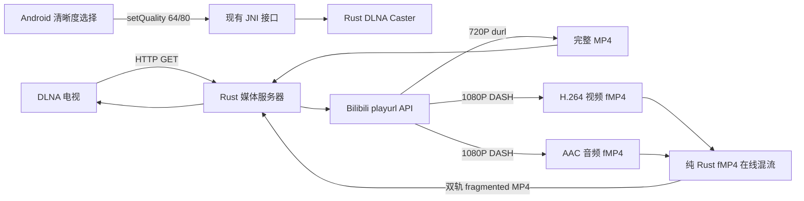
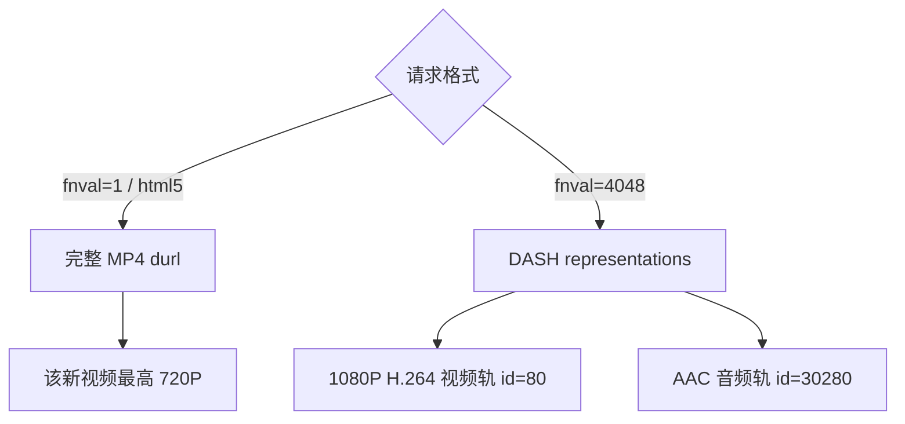
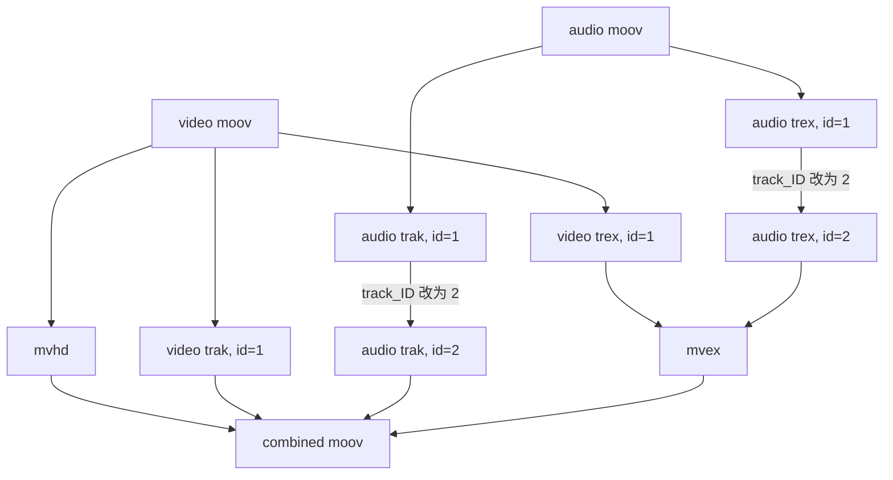
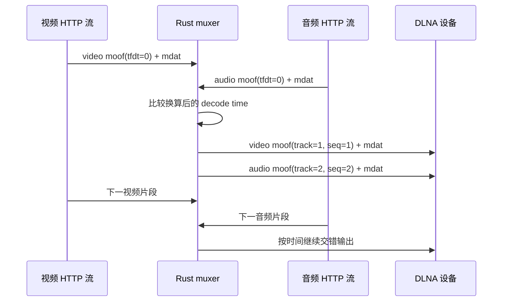

# Bilibili DLNA 1080P 与纯 Rust 在线混流

本文记录 ktv-casting 在不依赖 Cookie、FFmpeg 和 Android 媒体处理的前提下，将 Bilibili 1080P DASH 视频投送到 DLNA 设备的实现。

## 最终数据流



- 720P：保留原来的单 URL 代理路径，不增加额外处理。
- 1080P：Rust 同时读取 DASH 视频与音频，在线生成一个双轨 fragmented MP4。
- Android：只选择清晰度。获取媒体、同步和混流全部在 Rust 中完成。

## 匿名 1080P API

测试视频：`BV1dqj16aECG`，CID：`39334447539`。

```http
GET https://api.bilibili.com/x/player/playurl
    ?bvid=BV1dqj16aECG
    &cid=39334447539
    &qn=80
    &fnval=4048
    &fnver=0
    &fourk=0
    &try_look=1
Referer: https://www.bilibili.com/video/BV1dqj16aECG
User-Agent: Mozilla/5.0
```

关键参数：

| 参数 | 作用 |
| --- | --- |
| `fnval=4048` | 返回全部可用 DASH 表示，视频和音频分离 |
| `try_look=1` | 匿名请求仍可获得该视频的 1080P 试看轨 |
| `qn=80` | 表达 1080P 目标；DASH 模式最终仍应检查轨道 ID |
| `fourk=0` | 不请求 4K，减少无关表示 |

### 不要用顶层 quality 判断 DASH 清晰度

匿名返回的顶层 `data.quality` 可能仍然是 `64`，但 `data.dash.video` 已经包含 `id=80`。正确判断方式是：

```text
data.dash.video[].id == 80
```

然后优先选择 `codecs` 以 `avc1` 开头的轨道。H.264/AVC 比 HEVC、AV1 更适合常见 DLNA 电视。

实测选中的媒体：

| 轨道 | 编码 | 参数 | 时长 |
| --- | --- | --- | --- |
| 视频 | H.264 `avc1.640033` | 1920×1080，24000/1001 fps | 285.201563 秒 |
| 音频 | AAC-LC `mp4a.40.2` | 48 kHz，双声道 | 285.205333 秒 |

## 为什么完整 MP4 只能到 720P



Bilibili 的新视频通常只为较低清晰度保留带声音的完整 MP4。高分辨率以 DASH 形式保存，因此“获得一个 1080P 单 URL”并不是请求参数问题，而是源站没有提供这种文件。

## Bilibili DASH 文件结构

视频和音频 URL 都是单轨 fragmented MP4：

```text
视频: [ftyp][moov(video)][sidx][moof][mdat][moof][mdat] ...
音频: [ftyp][moov(audio)][sidx][moof][mdat][moof][mdat] ...
```

- `moov`：轨道初始化信息、编码参数和时间基。
- `sidx`：后续媒体片段索引，可计算输出总长度。
- `moof`：一个媒体片段的样本索引和解码时间。
- `mdat`：已经编码好的 H.264 或 AAC 样本数据。

## 手写混流原理

混流不等于转码。本实现不会解码 H.264/AAC，只重组 ISO BMFF 容器。

### 1. 合并初始化段



输出初始化段：

```text
[video ftyp]
[moov
  [mvhd next_track_ID=3]
  [video trak track_ID=1]
  [audio trak track_ID=2]
  [mvex [video trex=1] [audio trex=2]]
]
```

所有 patch 都是定长字段修改，不会改变子 box 大小。

### 2. 按时间戳交错片段

每个 `moof` 中的 `tfdt.baseMediaDecodeTime` 表示片段解码起点。视频和音频有不同 timescale，因此比较时使用交叉乘法，避免浮点误差：

```text
video_decode_time * audio_timescale
    <= audio_decode_time * video_timescale
```



输出过程中还会修改：

- 音频 `tfhd.track_ID`：`1 → 2`。
- 所有 `mfhd.sequence_number`：改成一个全局递增序列。
- `mdat`：原样输出，媒体字节不做任何修改。

### 3. 流式与内存边界

解析器按 box 读取，内存中最多保留视频、音频各一个 fragment。不会先下载完整文件，也不会把 100 MB 视频整体放入内存。HTTP 响应在初始化段完成后立即开始输出。

`sidx` 中所有 `referenced_size` 的总和用于计算精确的 `Content-Length`：

```text
combined_init_size + video_fragment_bytes + audio_fragment_bytes
```

这比纯 chunked 响应更兼容 DLNA 渲染器。

## 720P/1080P 切换

Android 继续调用已有接口：

```kotlin
RustEngine.setQuality(64) // 720P
RustEngine.setQuality(80) // 1080P (Beta)
```

Rust 的 `DlnaCaster` 只接受这两个值。切换后重新向设备设置相同媒体 URI，并尽可能恢复原播放位置。

1080P 标记为 Beta，原因是在线生成的 fragmented MP4 不提供任意字节 Range 映射；不同品牌 DLNA 设备对拖动进度的行为可能不同。

## 验证方法

### App 调试日志

1080P 链路的关键日志统一使用 `DLNA1080` tag，并通过 JNI
`RustEngine.onRustLog()` 写入 App 的 `LogRepository`，可在 App 日志页面查看。覆盖：

- 清晰度切换和媒体重载；
- 播放地址请求、API 错误及最终 DASH 编码轨选择；
- 视频/音频上游连接及 HTTP 错误；
- 初始化段大小、timescale 和预计 `Content-Length`；
- 每 100 个 fragment 的混流进度、正常完成或下游中断；
- HTTP HEAD 探测和开始向 DLNA 设备输出的时点。

如果某视频匿名 API 不提供 `id=80` 的 1080P DASH 轨道，DLNA 代理会记录 WARN 并自动回退到原有的 720P 完整 MP4，不会把播放器留在失败的 1080P 请求上。

CDN 地址在写入日志前会删除 query 参数，避免泄露临时 token、deadline 等鉴权信息。

完整网络测试：

```bash
cargo test fmp4_mux::tests::live_mux_target_video -- --ignored --nocapture
```

媒体检查：

```bash
ffprobe -v error \
  -show_entries stream=codec_name,codec_type,width,height,sample_rate,channels:format=duration,size \
  -of json target/bilibili-1080-mux-test.mp4
```

验收条件：

- 同一个 MP4 中恰好包含 H.264 视频和 AAC 音频。
- 视频为 1920×1080。
- 音频为 48 kHz 双声道。
- 两轨时长差小于一个 AAC frame。
- 输出字节数与根据 `sidx` 计算的 `Content-Length` 完全一致。

## 相关代码

- `src/bilibili_parser.rs`：720P durl 与匿名 1080P DASH 选择。
- `src/fmp4_mux.rs`：box 解析、初始化段合并、片段交错。
- `src/media_server.rs`：DLNA HTTP 响应与混流入口。
- `src/cast/dlna_caster.rs`：清晰度状态和即时重载。

## 标准与参考资料

- [W3C ISO BMFF Byte Stream Format](https://www.w3.org/TR/mse-byte-stream-format-isobmff/)：初始化段及 `moof + mdat` 媒体段结构。
- [ISO/IEC 14496-12:2026](https://www.iso.org/obp/ui?_escaped_fragment_=iso%3Astd%3Aiso-iec%3A14496%3A-12%3Aed-8%3Av1%3Aen)：ISO Base Media File Format box 与 movie fragment 定义。
- [MPEG-DASH 标准入口](https://www.mpeg.org/standards/MPEG-DASH/)：DASH 对 ISO BMFF 和 MPEG-2 TS 的承载模型。
- [Microsoft DLNA HTTP Transport 说明](https://learn.microsoft.com/en-us/openspecs/windows_protocols/ms-dlnhnd/ef75437e-3cc0-44f6-a8d7-66ca62b0f979)：DLNA 内容通过 HTTP 传输的要求。
- `b-api/docs/video/videostream_url.md`：Bilibili `qn`、`fnval`、`try_look` 与 DASH 响应字段说明。
